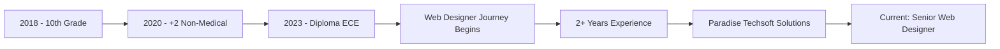

## Hi there 👋

<!--
**kartikwebcraft/kartikwebcraft** is a ✨ _special_ ✨ repository because its `README.md` (this file) appears on your GitHub profile.

Here are some ideas to get you started:

- 🔭 I’m currently working on ...
- 🌱 I’m currently learning ...
- 👯 I’m looking to collaborate on ...
- 🤔 I’m looking for help with ...
- 💬 Ask me about ...
- 📫 How to reach me: ...
- 😄 Pronouns: ...
- ⚡ Fun fact: ...
--># 👋 Hi there, I'm Kartik Sharma!

<div align="center">
  
  
  
</div>

<div align="center">
  
  [](https://www.linkedin.com/in/kartikwebcraft)
  [](YOUR_PORTFOLIO_URL)
  [](mailto:kartikshama6@gmail.com)
  
</div>

---

## 🚀 About Me

```javascript
const kartik = {
    role: "Web Designer & Frontend Developer",
    company: "Paradise Techsoft Solutions Pvt. Ltd.",
    location: "Una, Himachal Pradesh, India",
    experience: "2+ Years",
    
    skills: {
        frontend: ["HTML5", "CSS3", "Responsive Design", "Mobile-First"],
        wordpress: ["Elementor", "Avada", "Divi", "Gutenberg"],
        ecommerce: ["Shopify", "Metafields 2.0", "Replo Builder", "Liquid"],
        design: ["UI/UX", "Design Systems", "Global Themes", "SEO"],
        tools: ["Figma", "Adobe XD", "Git", "VS Code"]
    },
    
    currentFocus: "Building scalable design systems and high-converting web experiences",
    funFact: "I turn coffee ☕ into beautiful websites 🎨"
};
```

---

## 💼 Professional Experience

### 🎯 **Web Designer** @ Paradise Techsoft Solutions Pvt. Ltd.
*Present*

- 🏆 Successfully delivered **50+ WordPress websites** with zero critical issues
- ⚡ Reduced development time by **40%** through global theme systems
- 🎨 Achieved **95% client satisfaction** rating for design quality
- 📈 Improved team efficiency by **35%** with design system implementation

---

## 🛠️ Tech Stack & Tools

<div align="center">

### Frontend Technologies


### WordPress Ecosystem


### E-Commerce Platforms


### Design Tools


### Development Tools


</div>

---

## 📊 GitHub Stats

<div align="center">
  
  
  
  

</div>

<div align="center">
  
  
  
  

</div>

---

## 🎨 Featured Projects

<div align="center">

<table>
  <tr>
    <td width="50%">
      <h3 align="center">E-Commerce Shopify Store</h3>
      <div align="center">
        <a href="PROJECT_LINK" target="_blank">
          
        </a>
        <p><strong>HTML, CSS, Liquid, Shopify</strong> - Custom theme with Metafields 2.0 integration for dynamic product catalog</p>
      </div>
    </td>
    <td width="50%">
      <h3 align="center">Corporate WordPress Website</h3>
      <div align="center">
        <a href="PROJECT_LINK" target="_blank">
          
        </a>
        <p><strong>WordPress, Elementor, Custom CSS</strong> - Responsive corporate website with global theme system</p>
      </div>
    </td>
  </tr>
  <tr>
    <td width="50%">
      <h3 align="center">Landing Page Design</h3>
      <div align="center">
        <a href="PROJECT_LINK" target="_blank">
          
        </a>
        <p><strong>HTML5, CSS3, JavaScript</strong> - High-converting landing page with modern animations</p>
      </div>
    </td>
    <td width="50%">
      <h3 align="center">Portfolio Website</h3>
      <div align="center">
        <a href="PROJECT_LINK" target="_blank">
          
        </a>
        <p><strong>Responsive Design, CSS Grid</strong> - Personal portfolio showcasing web design projects</p>
      </div>
    </td>
  </tr>
</table>

</div>

---

## 🏆 Achievements & Highlights

```diff
+ 50+ WordPress websites delivered successfully
+ 95% client satisfaction rating
+ 40% reduction in development time through optimization
+ 35% improvement in team collaboration efficiency
+ Expert in Shopify Metafields 2.0
+ 90+ PageSpeed Insights scores consistently achieved
```

---

## 📈 Professional Journey



---

## 🎯 Current Focus

- 🔭 Working on: **Advanced Shopify theme customization with Metafields 2.0**
- 🌱 Learning: **React.js and modern JavaScript frameworks**
- 👯 Looking to collaborate on: **Open-source web design projects**
- 💬 Ask me about: **WordPress, Shopify, Responsive Design, UI/UX**
- ⚡ Fun fact: **I can build a responsive website faster than making coffee!**

---

## 📚 Latest Blog Posts

<!-- BLOG-POST-LIST:START -->
- 🎨 [Mastering Elementor Pro: Advanced Techniques](BLOG_LINK)
- 🛒 [Shopify Metafields 2.0: Complete Guide](BLOG_LINK)
- 📱 [Mobile-First Design: Best Practices 2024](BLOG_LINK)
- 🚀 [Optimizing WordPress Performance](BLOG_LINK)
<!-- BLOG-POST-LIST:END -->

---

## 🤝 Let's Connect!

<div align="center">

### 💼 Open for Freelance Projects & Collaborations

<p>I'm always excited to work on new web design projects and collaborate with fellow developers!</p>

[](YOUR_LINKEDIN_URL)
[](YOUR_PORTFOLIO_URL)
[](mailto:YOUR_EMAIL)
[](YOUR_TWITTER_URL)

</div>

---

## 📊 Profile Views & Activity

<div align="center">
  
  
  
  

</div>

---

## 🎨 Design Philosophy

> *"Good design is obvious. Great design is transparent."* — Joe Sparano

<div align="center">

### My Approach to Web Design

| Principle | Description |
|-----------|-------------|
| 🎯 **User-Centric** | Design with the user's needs and experience as top priority |
| 📱 **Mobile-First** | Start with mobile and scale up for larger screens |
| ⚡ **Performance** | Fast-loading websites with optimized code and assets |
| ♿ **Accessible** | Inclusive design that works for everyone |
| 🎨 **Aesthetic** | Beautiful, modern designs that capture attention |
| 🔧 **Maintainable** | Clean, organized code that's easy to update |

</div>

---

## 🛠️ WordPress Expertise

<div align="center">

### Page Builders I Master

<table>
  <tr>
    <td align="center" width="25%">
      <br>
      <strong>Elementor Pro</strong><br>
      <sub>Advanced widgets & templates</sub>
    </td>
    <td align="center" width="25%">
      <br>
      <strong>Avada Theme</strong><br>
      <sub>Fusion Builder mastery</sub>
    </td>
    <td align="center" width="25%">
      <br>
      <strong>Divi Builder</strong><br>
      <sub>Visual design expert</sub>
    </td>
    <td align="center" width="25%">
      <br>
      <strong>Gutenberg</strong><br>
      <sub>Block editor pro</sub>
    </td>
  </tr>
</table>

</div>

---

## 🎓 Education

```yaml
Diploma: Electronics & Communication Engineering
Year: 2023
Grade: 68%

Higher Secondary: Non-Medical
Year: 2020
Grade: 60%

Secondary School: 10th Grade
Year: 2018
Grade: 60%
```

---

## 💡 Skills Breakdown

<div align="center">

```text
Frontend Development    ████████████████████░   95%
WordPress Customization ████████████████████░   95%
Shopify Development     ███████████████████░░   90%
UI/UX Design           ██████████████████░░░   85%
Responsive Design      ████████████████████░   95%
Performance Optimization ██████████████████░░░   85%
SEO Best Practices     ████████████████░░░░░   80%
```

</div>

---

## 🌟 Testimonials

> *"Kartik delivered an exceptional WordPress website that exceeded our expectations. His attention to detail and design skills are outstanding!"*  
> — **Client Name**, Company Name

> *"Professional, creative, and always on time. Kartik's Shopify expertise helped us launch our store with zero issues."*  
> — **Client Name**, E-commerce Business

---

<div align="center">

### 🎯 Let's Build Something Amazing Together!


---

<sub>⭐ From [Kartik Sharma](https://github.com/YOUR_GITHUB_USERNAME) with ❤️</sub>

</div>

